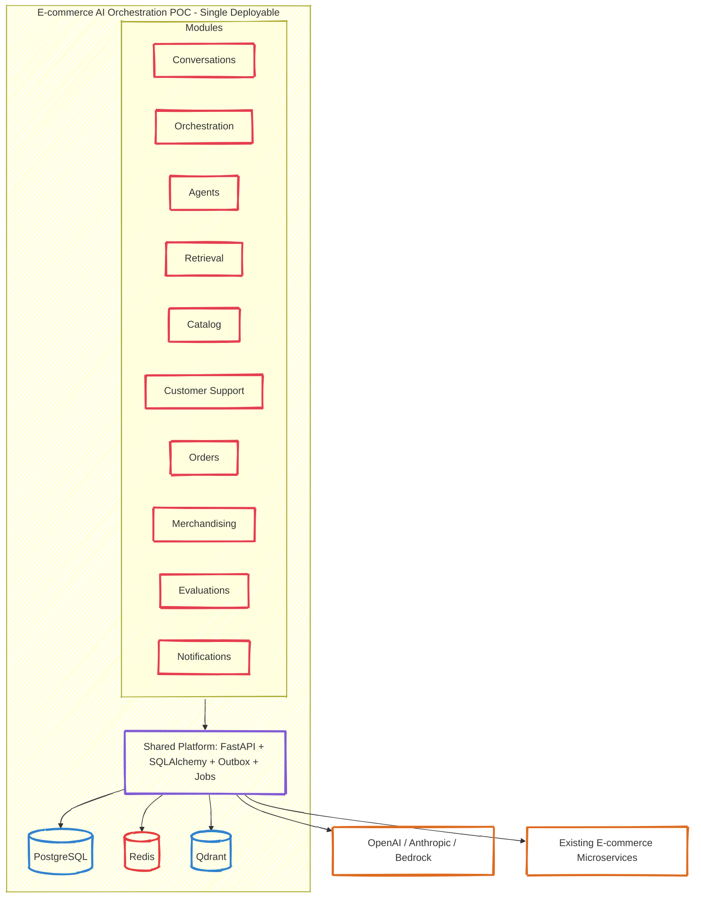
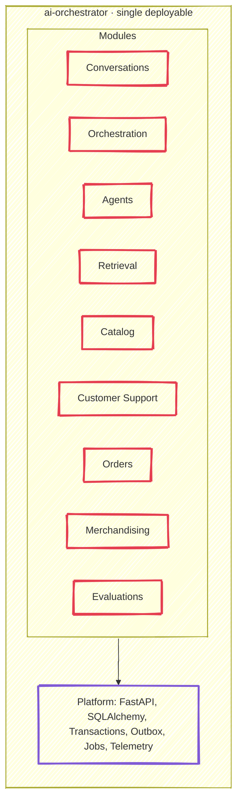
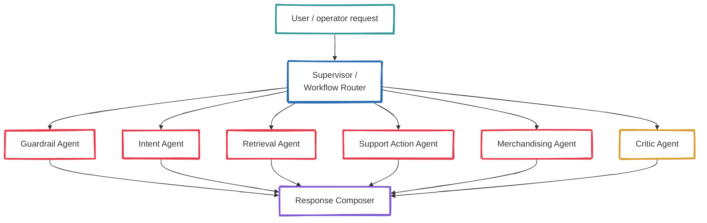
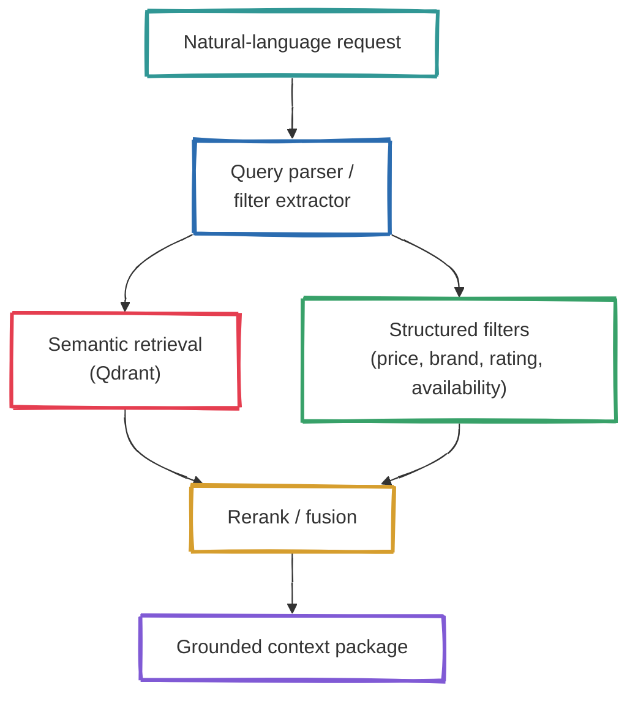
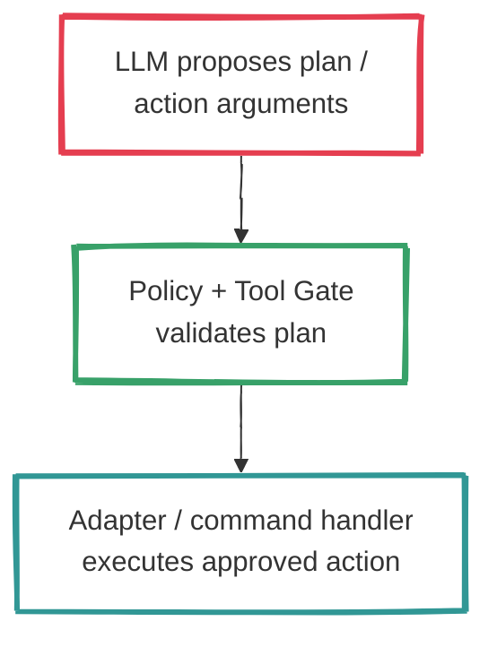
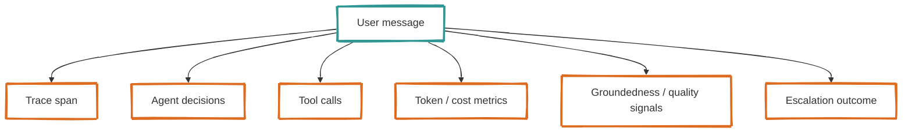

# E-commerce AI Orchestration POC Architecture Documentation

*Exploring how collaborative autonomous agents can be introduced into an e-commerce platform through one AI orchestration service before splitting responsibilities further*

---

## About This Section

This pack explains not only **what** the proposed POC looks like, but **why** a single AI orchestration service is the right starting point for introducing agentic workflows into an existing e-commerce platform.

The design goal is to demonstrate:

- collaborative agent orchestration;
- safe tool use for support and order flows;
- RAG over catalog, customer, and policy data;
- observability and evaluation from day one;
- future extraction into dedicated AI services without rewriting the domain.

---

## Architecture Guide Index

### Core Concepts
| Document | Description | What It Clarifies |
|----------|-------------|-------------------|
| [C4 — Context](./c4-context.md) | People, systems, and trust boundaries | Who interacts with the POC |
| [C4 — Containers](./c4-container.md) | Main deployable/runtime blocks | What runs where |
| [C4 — Components](./c4-components-orchestrator.md) | Orchestration internals | How collaborative flows are coordinated |
| [Agent Workflows](./agent-workflows.md) | Main autonomous collaboration flows | How agents cooperate safely |

### Decisions
| Document | Description | Status |
|----------|-------------|--------|
| [ADR 001](../adr/001-orchestrator-service-first.md) | Start with one orchestration service | Accepted |
| [ADR 002](../adr/002-collaborative-agent-orchestration.md) | Use supervised multi-agent patterns | Accepted |
| [ADR 003](../adr/003-hybrid-retrieval-and-provider-abstraction.md) | Use hybrid retrieval + provider abstraction | Accepted |
| [ADR 004](../adr/004-evaluation-and-human-review-first.md) | Evals and human review are first-class | Accepted |

### Supporting Docs
| Document | Description | Where to Look |
|----------|-------------|---------------|
| [Modules](../modules/README.md) | Module boundaries and ownership | Domain decomposition |
| [API Sketch](../api/README.md) | Main HTTP endpoints | Request entrypoints and internal hooks |

---

## Architectural Principles

### 1. One AI Orchestration Service First

**Why this matters:**

- **Fastest path to useful production evidence** — one deployable and one debugging surface
- **Lower operational risk** — new AI logic is centralized instead of spread across many services
- **Clean integration with the existing platform** — adapters call current catalog, order, customer, and support APIs
- **Better for a POC** — prompt, eval, and retrieval iteration stay fast

### 2. Agent Orchestration Must Be Supervised

The system does not grant open-ended autonomy. Every collaborative flow is bounded by:

- max steps / budget;
- tool allowlists;
- confidence thresholds;
- escalation conditions;
- auditability.

### 3. Retrieval Is Hybrid, Not “Vector Only”

That is critical for e-commerce because many queries combine fuzzy intent with hard constraints.

### 4. Business Actions Are Separated From LLM Reasoning

The model never directly owns side effects such as refund initiation, order updates, or catalog changes.

### 5. Evaluation and Tracing Are First-Class

The POC should prove not only that “the AI feature works”, but that:

- we can inspect why it answered the way it did;
- we can compare prompts, providers, and retrieval strategies;
- we can identify failure modes early.
