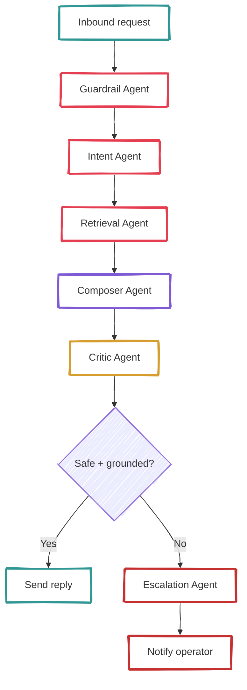
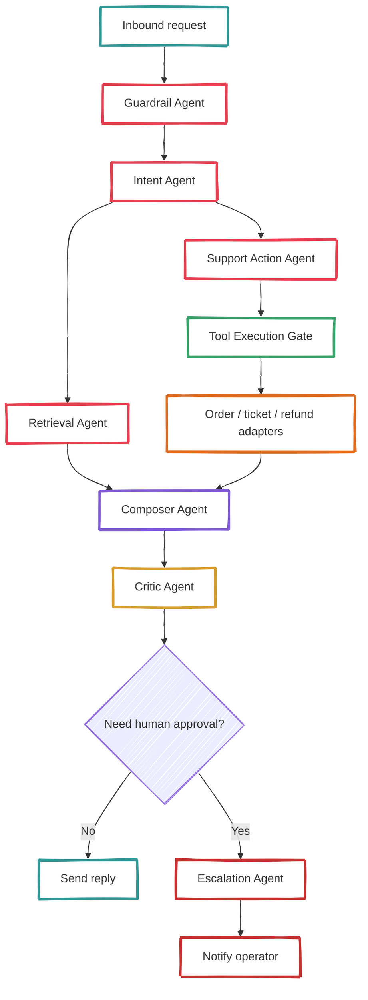
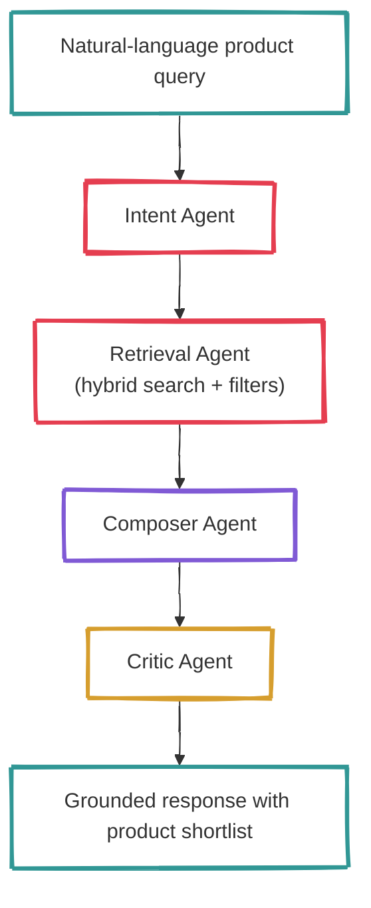
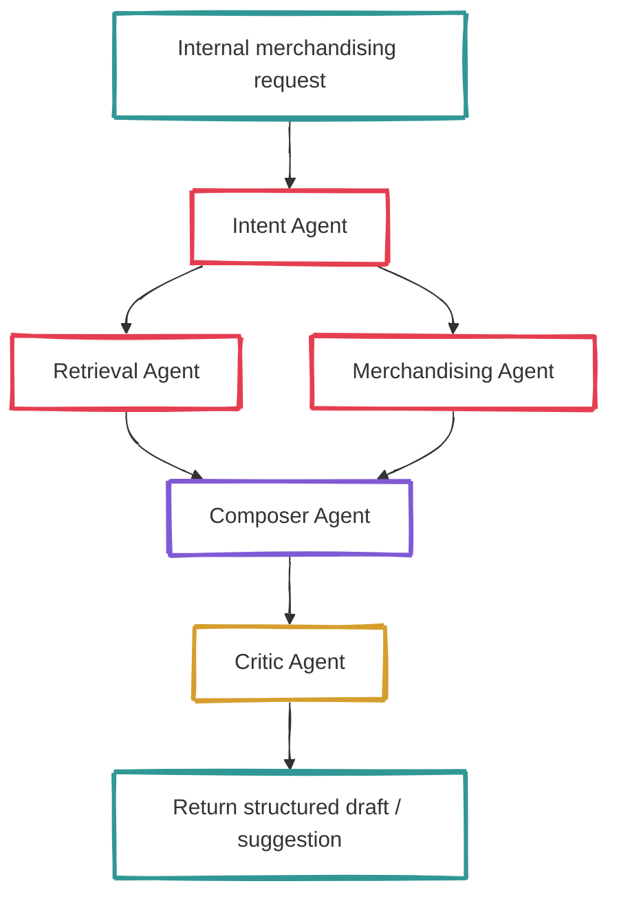
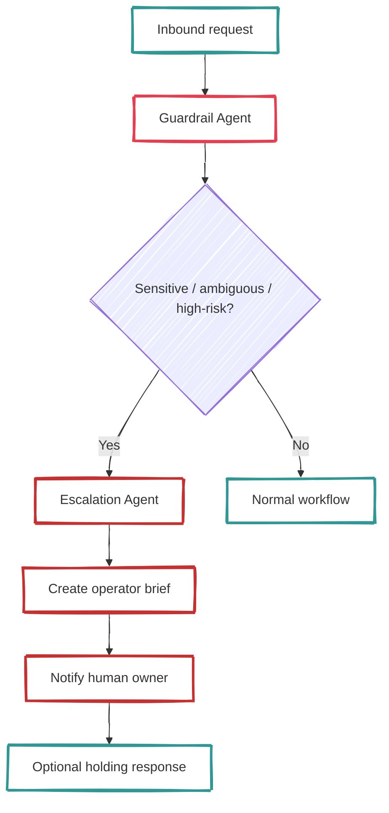

# Agent Workflows

*Collaborative autonomous agent workflows for the e-commerce AI orchestration POC*

---

## Design Goal

The POC should prove **collaboration between specialized agents** instead of relying on one giant prompt. Each workflow combines deterministic orchestration with constrained agent autonomy.

Core idea:
- the system chooses a workflow;
- agents contribute partial work;
- tools are executed only through explicit gates;
- a critic and escalation policy prevent unsafe over-confidence.

---

## Agent Catalog

| Agent | Responsibility | Can Call Tools? | Notes |
|------|----------------|-----------------|------|
| Intent Agent | Classify request and route workflow | No | Fast, low-cost model preferred |
| Guardrail Agent | Detect policy/safety/escalation-sensitive content | No | Runs early |
| Retrieval Agent | Retrieve and summarize grounded evidence | Read-only retrieval | No side effects |
| Support Action Agent | Propose support/order actions and parameters | Proposes only | Never executes directly |
| Merchandising Agent | Produce enrichment / campaign suggestions | Read-only lookup | Optional branch |
| Critic Agent | Review groundedness, policy fit, completeness | No | Can force escalation |
| Escalation Agent | Package request for human handoff | No | Creates concise operator brief |
| Composer Agent | Produce final response or draft output | No | Last generation stage |

---

## Workflow 1 — Customer Support FAQ / Policy Question

### Goal
Answer support-style questions about shipping, returns, warranties, and other grounded policy topics.

## Workflow 2 — Order Status / Return / Refund Request

## Workflow 3 — Catalog Q&A / Guided Discovery

## Workflow 4 — Merchandising Copilot

## Workflow 5 — Escalation-First Path

