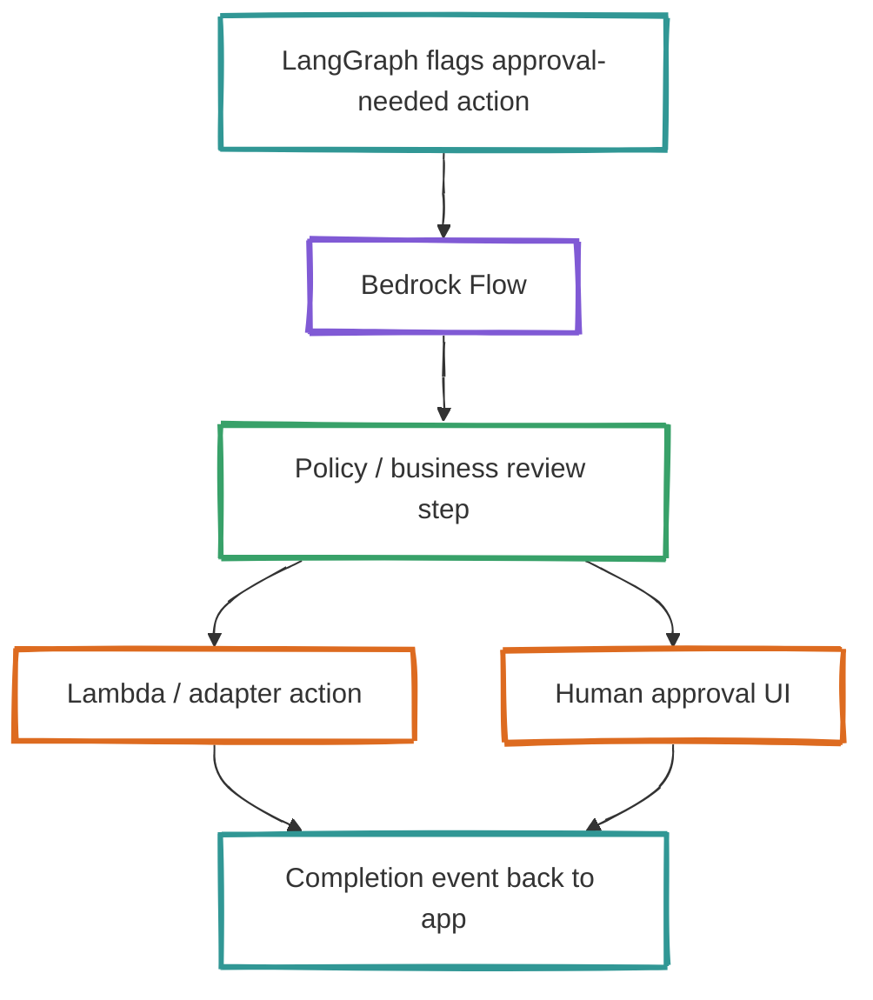
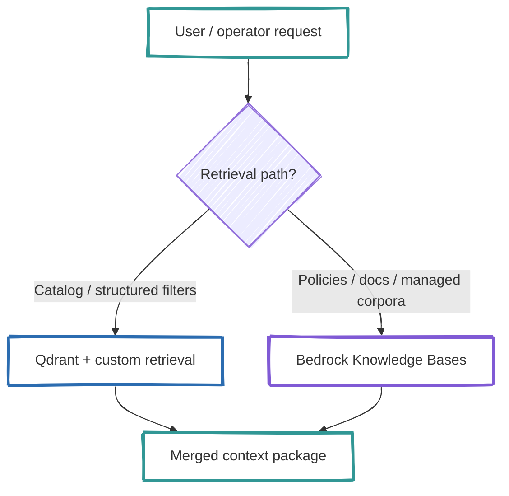

# Optional Additions — Bedrock Flows and Knowledge Bases

This document describes the **optional** AWS-managed pieces that can sit next to the current Python-first architecture.

They are optional on purpose:
- they solve specific operational problems well
- they should not replace the whole stack unless the platform becomes Bedrock-first

## 1. Bedrock Flows for visible approval workflows

Use Bedrock Flows when the business wants:
- visually understandable workflow steps
- visible approval gates
- a managed path for prompt/model/Lambda/knowledge-base orchestration

### Best-fit use cases in this repo
- refund approval workflow
- support escalation triage workflow
- merchandising content review workflow
- operator-in-the-loop flows where the graph should be easy to explain to non-engineers

### Recommended boundary
Keep **LangGraph** as the default orchestration runtime for application logic.
Use **Flows** only for a subset of workflows where visibility and explicit step wiring matter more than maximum code-level flexibility.

### Example approval path

## 2. Knowledge Bases for selected managed-RAG paths

Use Knowledge Bases only where managed RAG clearly beats our custom path.

### Good candidates
- policy/help-center corpora
- low-change document collections
- internal knowledge where source connectors and managed ingestion save time
- multimodal document processing where Bedrock-managed parsing is valuable

### Keep custom retrieval for
- catalog search with rich structured filters
- ranking flows that depend on custom business logic
- retrieval paths tightly coupled to Qdrant tuning and metadata strategy

### Hybrid retrieval split

## Recommended decision rule

### Choose Flows when:
- the workflow needs to be easy to present visually
- approval/handoff steps matter more than raw coding freedom
- the workflow already fits a node/step model

### Choose Knowledge Bases when:
- the corpus is document-heavy and operationally expensive to manage manually
- managed ingestion/chunking/session context is valuable
- retrieval does not depend on custom business ranking logic

### Keep current custom stack when:
- the workflow is highly application-specific
- the retrieval path is tightly coupled to structured e-commerce filters
- portability and provider-agnostic behavior remain top priorities

## Recommended scope for this repo

Do this next only after AgentCore governance is defined:

1. Add one **Flow** example for refund approval.
2. Add one **Knowledge Base** example for help-center/policy content.
3. Keep the catalog path on Qdrant.
4. Do not replace the main LangGraph orchestrator.
