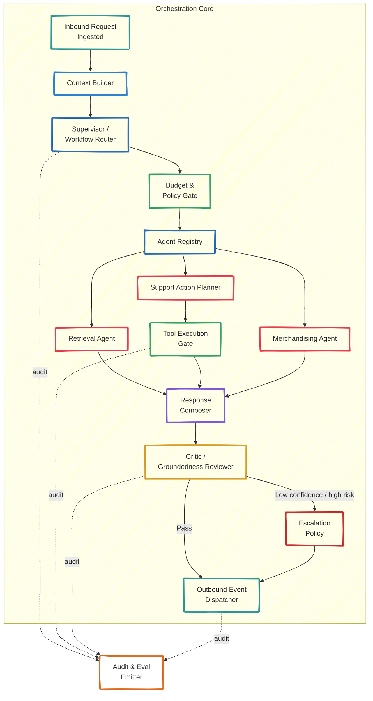

# C4 — Level 3: Components of the Orchestration Core

*How collaborative autonomous agent execution is coordinated inside the AI orchestration service*

---

## Component Diagram

---

## Components

### Supervisor / Workflow Router
Selects which workflow to run for the current request and enforces step budgets.

### Budget & Policy Gate
Global control point that prevents unsafe or runaway execution.

Typical checks:
- max tokens;
- max external tool calls;
- max wall-clock time;
- tool eligibility by workflow;
- escalation-required categories.

### Agent Registry
Catalog of available agents and their contracts.

Examples:
- `IntentAgent`
- `GuardrailAgent`
- `RetrievalAgent`
- `SupportActionAgent`
- `MerchandisingAgent`
- `CriticAgent`
- `EscalationAgent`
- `ComposerAgent`

### Context Builder
Builds the working context from recent turns, summaries, actor context, routing hints, and workflow-specific retrieval inputs.

### Retrieval Agent
Builds grounded context from semantic search, metadata filters, policy excerpts, order snippets, and reranked evidence.

### Support Action Planner
Turns support/order intent + retrieved context into a structured plan. The plan is a proposal, not an executable side effect by itself.

### Merchandising Agent
Handles catalog and campaign-oriented assistance such as attribute hints, enrichment suggestions, and bundle ideas.

### Tool Execution Gate
The only place where business actions can be executed.

### Critic / Groundedness Reviewer
Checks groundedness, policy fit, contradiction to evidence, completeness, and confidence.

### Response Composer
Builds the final user-facing or operator-facing answer from retrieved knowledge, structured action results, and merchandising suggestions.

### Escalation Policy
Decides when to involve a human.

### Audit & Eval Emitter
Emits structured records for every meaningful step so later analysis can explain cost, failure modes, and quality.
