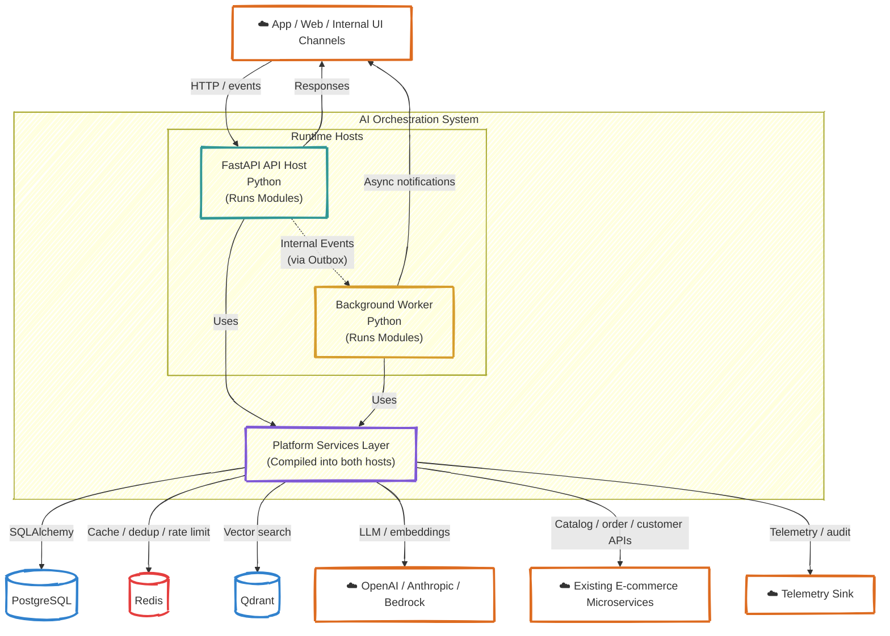

# C4 — Level 2: Containers

<div align="center">

*Major runtime building blocks for the AI orchestration POC*

</div>

---

## Container Diagram



---

## Containers Explained

### 1. FastAPI API Host
**Purpose:**
- receives shopper, support, merchandising, or admin requests;
- exposes playground/admin endpoints;
- exposes health/readiness endpoints.

### 2. Background Worker Host
**Purpose:**
- dispatch outbox messages;
- run async orchestration steps;
- process retries and scheduled evals;
- run embedding refresh and dataset jobs.

**Internal Structure (Shared by both hosts):**
Both hosts deploy the exact same internal code modules and platform services:
- **Modules**: Conversations, Orchestration, Agents, Retrieval, Catalog, Customer Support, Orders, Merchandising, Evaluations, Notifications.
- **Platform**: DB setup, provider abstraction, vector store adapter, internal event bus, telemetry, auth.

### 3. PostgreSQL
Primary durable store with per-module owned tables and an outbox table for async internal workflows.

### 4. Redis
Used for rate limiting, short-lived caching, idempotency / deduplication keys, and lightweight coordination.

### 5. Qdrant
Purpose-built vector store for semantic retrieval over product, policy, and KB content with metadata filtering.

### 6. OpenAI / Anthropic / Bedrock
External providers for generation and embeddings, wrapped behind a local abstraction.

### 7. Existing E-commerce Microservices
Represents the current platform that the POC plugs into: catalog, order management, customer/profile, support/ticketing, pricing/inventory.

---

## Container Interactions

### Synchronous path
```text
Channel / UI → FastAPI → Conversations → Orchestration → response or enqueue more work
```

### Asynchronous path
```text
Request persisted → Outbox event → Worker → Orchestration / Evaluations / Notifications
```

### External action path
```text
Approved workflow → Orders / Support adapter → Existing microservice APIs
```

### Retrieval path
```text
Parsed query → Qdrant + metadata filters + source snippets → grounded context package
```
