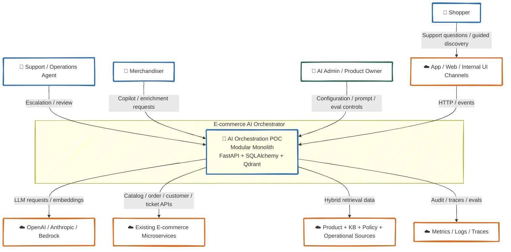

# C4 — Level 1: System Context

*How the E-commerce AI Orchestration POC fits into its surrounding world*

---

## Context Diagram

---

## Actors and External Systems

### Shopper
Interacts indirectly through support or assisted product-discovery experiences.

Typical intents:
- ask product or policy questions;
- request order-status help;
- ask return / refund questions;
- seek recommendation-style guidance.

### Support / Operations Agent
Receives escalations when the system should not answer or act autonomously.

Typical triggers:
- low-confidence answers;
- sensitive refund or compensation flows;
- repeated misunderstanding;
- integration failures.

### Merchandiser
Uses the system as a copilot for catalog and campaign workflows.

Typical use cases:
- enrich product attributes;
- draft product copy;
- identify missing metadata;
- prepare bundle or campaign suggestions.

### AI Admin / Product Owner
Configures prompts, tools, providers, eval sets, and rollout policies.

### App / Web / Internal UI Channels
Represents any front door for the POC:
- internal support console,
- admin playground,
- shopper-facing assistant widget,
- backoffice workflow UI.

### OpenAI / Anthropic / Bedrock
Model and embedding providers behind a local abstraction layer.

### Existing E-commerce Microservices
Source of truth for:
- catalog data,
- orders,
- customers,
- pricing,
- inventory,
- support workflows.

### Product / KB / Policy / Operational Sources
Structured and semi-structured content used for RAG:
- catalog descriptions and attributes,
- help-center articles,
- return and shipping policies,
- order event snippets,
- operational runbooks.

### Metrics / Logs / Traces
Destination for observability and evaluation data.

---

## System Responsibilities

The POC system is responsible for:

- receiving requests safely and idempotently;
- preserving conversation and workflow state;
- orchestrating multiple specialized agents;
- retrieving grounded context and proposing approved tools;
- composing user-facing or operator-facing outputs;
- escalating to humans when needed;
- logging every meaningful step for audit and evaluation.

It is **not** responsible for:

- replacing catalog/order/customer systems of record;
- unconstrained autonomous execution;
- becoming the final source of truth for operational side effects.
